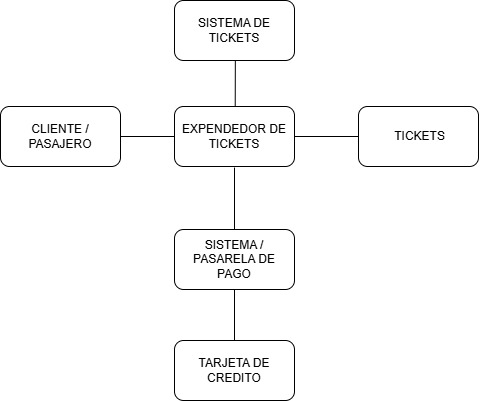
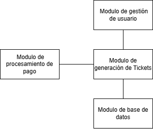

# DISEÑO-DE-SOFTWARE
## EXPENDEDOR DE TICKETS 

1. El analisis termina cuando se tienen definidas claramente las necesidades del sistema y se suple la pregunta ¿Qué debe hacer el software? Y se plantea la pregunta ¿Cómo se va a hacer? 

2.  Como se va a estructurar la base de datos, el lenguaje a usar, como el sistema se conecta con otros sistemas, como se va a manejar los errores, que medidas de seguridad aplicar, vista de desplieuge (el como el sistema interactua con el hardware), el como el sistema interactua con el usuario, definición de la vista de escenarios. 

3. Mostrar en pantalla un mensaje claro y entendible para el usuario sobre el error, registrar un mensaje explicativo del error, incluyendo datos como la hora y el id del usuario.

## Diagramas sistema Expendedor de tickets

### Abstración 

### Modularidad 
